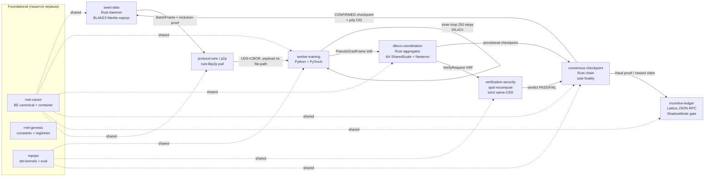

# ResonanceNet Protocol — Итоговая архитектурная спека (v0.1, для реализации)

Этот документ — источник истины для написания кода. Он не пересматривает зафиксированные решения (dense Llama, DiLoCo, seed-mining-pool, Adafactor-layerwise, WSD, μP, llama.cpp/GGUF, Lattica-инцентив), а **разрешает 106 замечаний ревью в конкретные единые контракты** и даёт честный вердикт по главному нерешённому риску (детерминизм/верификация). Каждое «раньше было по-разному» ниже сведено к ОДНОМУ решению. Где решение = «сначала замерь» — это сказано прямо.

Ключевой принцип, вытекающий из сквозных критик: **девять компонентов изобрели девять диалектов** (хеш, magic, кодек, endianness, identity, деривация батча). Первым пишется НЕ компонент, а три общих основания — `rnet-canon`, `rnet-genesis`, `repops` — от которых зависят все. Без этого рантайм материализует девять диалектов.

---

## 1. Архитектура одним взглядом

**Языки (build-vs-buy):**
- **Python 3.12 + PyTorch** — только `worker-training` (обёртка над `model_llama.py`) и Python-референс верификатора. Линкует из Rust НОЛЬ.
- **Rust** — весь сетевой/протокольный/консенсусный/крипто/деньги слой: `p2p`, `seed-data`, `diloco-coordination`, `verification-security` (кроме вычислительного ядра replay), `consensus-checkpoint`, `incentive-ledger`, `protocol-wire`. Причина: memory-safety на untrusted-байтах, детерминированная сериализация, целочисленная арифметика.
- **BUY, не переписываем:** rust-libp2p (транспорт/kad/gossip/NAT), llama.cpp (inference, НЕ патчим), Lattica (форк Bitcoin Core, JSON-RPC), blake3, ML-DSA-крейт (парити с Lattica).

**Поток данных (happy path):**



**Границы доверия:** воркер НЕ доверен (spot-recompute), координатор НЕ доверен (детерминированная воспроизводимая агрегация), seed частично доверен но кросс-верифицируем (кворум root'ов). **consensus-checkpoint — единственный владелец канонической головы цепи.** `diloco` эмитит provisional + вердикты как ВХОД в финальность, не дублирует её.

---

## 2. Repo-layout

```
resonancenet/
├── rnet-genesis/                 # Rust lib — ИММУТАБЕЛЬНЫЕ константы + реестры
│   └── src/lib.rs                #   NETWORK_MAGIC, HASH=BLAKE3-256, endianness-политика,
│                                 #   obj-magic registry, SIG_ALG_ID, CRC=CRC32C(Castagnoli),
│                                 #   determinism-class registry, RNG-scheme registry,
│                                 #   dtype-tag enum, RoundDescriptor(round0)=RN-1B, GENESIS_HASH
├── rnet-canon/                   # Rust lib — каноническая BE-сериализация + контейнер
│   ├── src/container.rs          #   CanonContainer{magic,ver,obj_type,len,content_hash,crc32c}
│   ├── src/layout.rs             #   фикс BE, count-prefixed, порядок тензоров/сэмплов
│   └── tests/golden_vectors/     #   кросс-язык golden (Rust==Python) для КАЖДОГО хешируемого типа
├── repops/                       # Детерминированные ядра — ФУНДАМЕНТ верификации
│   ├── rust/                     #   repops_eval (forward-only, held-out gate, i64 CE)
│   └── python/                   #   det-attention, det-CE, soft-poly (опц. cross-vendor)
├── worker/                       # Python 3.12 + PyTorch
│   └── rn_worker/
│       ├── determinism.py  model_adapter.py  optimizer_adafactor.py
│       ├── scheduler_wsd.py  mup.py  batch_stream.py  diloco.py
│       ├── spot_recompute.py  checkpoint.py  gguf_export.py
│       ├── config_hash.py  ipc.py            # UDS+CBOR к p2p-демону (НЕ gRPC)
│       └── worker_main.py
├── seed-data/                    # Rust daemon
│   └── src/{dataset_store,merkle_index,shard_server,batch_scheduler,
│            provenance_log,manifest_builder,cross_seed_verify}.rs
├── p2p/                          # Rust daemon (rnet-p2p, single static binary)
│   └── src/{core,bootstrap,transport,discovery,reachability,content,
│            gossip,bulk_stream,ipc}.rs
├── diloco-coord/                 # Rust
│   └── src/{round_manager,gradient_submission,aggregation,outer_optimizer,
│            elastic_membership,straggler_policy,hetero_balancer,
│            checkpoint_store}.rs   # NB: НЕ владеет финальностью
├── verification/                 # Rust (протокол/крипто) + Python (replay-ядро через repops)
│   └── src/{challenge_sampler,workunit_commit,tensor_canon,bisection_referee,
│            stake_escrow,sybil_gate,verifier_pool}.rs
├── consensus/                    # Rust — ЕДИНЫЙ владелец головы
│   └── src/{ckpt_format,ckpt_chain,heldout_committee,heldout_gate,
│            rollback,freshness,attestation_net}.rs
├── incentive/                    # Rust
│   └── src/{ledger_core,reward_accounting,commit_reveal,stake_registry,
│            slashing_engine,payout_engine,lattica_rpc,genesis_guard,
│            manifest_registry}.rs
└── protocol-wire/                # Rust — схема сообщений (НЕ параллельный кодек)
    └── src/{proto,wire,handshake,lattica_rpc}.rs
```

**`protocol-wire` не владеет фреймингом транспорта** — p2p владеет транспортным фреймингом (libp2p), protocol-wire определяет схему сообщений и `rnet-canon`-контейнер для хешируемых объектов. protobuf/prost допустим ТОЛЬКО для не-хешируемого control-plane; всё подписываемое/хешируемое — через `rnet-canon`.

---

## 3. Wire-протокол

### 3.1 Единые решения (разрешение C2/C4/C5/H8/H10)

| Аспект | РЕШЕНИЕ | Заменяет |
|---|---|---|
| Хеш content-identity | **BLAKE3-256 везде.** dataset_root, batch_id, weights_merkle_root, checkpoint_id, pseudo-grad root | seed-data SHA3 → BLAKE3. SHA3 остаётся ТОЛЬКО как отдельный anchor-digest для Lattica, если код Lattica это требует (pre-code проверка) |
| CRC | **CRC32C (Castagnoli, poly 0x1EDC6F41).** `crc32c` крейт (Rust) + `google-crc32c` (Python) | crc32fast (это IEEE, НЕ Castagnoli — баг в 3 компонентах) |
| Кодек хешируемых объектов | **rnet-canon** (ручная BE фикс-раскладка, count-prefixed) | protobuf/borsh/CBOR для хешируемого — запрещены |
| Кодек control-plane | CBOR (ciborium/cbor2) для транспорт-envelope; protobuf опц. | — |
| Endianness | **BE для метаполей контейнера.** ЯВНОЕ ИСКЛЮЧЕНИЕ: token-payload = u32 **LE** (source of truth = seed) | protocol-wire BE-для-токенов → LE |
| Identity/подпись | **ML-DSA (PQ, парити с Lattica) для ВСЕЙ app-authority.** Поля length-prefixed. `sender=BLAKE3(pq_pubkey)`, полный ключ передаётся отдельно. Ed25519 — ТОЛЬКО внутренний libp2p node-id, из демона не выходит | все `[32]pubkey`/`[64]sig` → length-prefixed PQ |
| Порядок параметров | **Лексикографическая сортировка ДЕДУПЛИЦИРОВАННЫХ имён** (tied tok/head = один параметр, каноническое имя = лексикографически первое). `layout_hash` пиннит; все компоненты reject при несовпадении | named_parameters() (p2p) → лексикографический дедуп |
| protocol_version | u32 (major<<16\|minor) везде | u16/u8+u8 |

### 3.2 Реестр obj-magic (genesis, единый на весь стек)

`RNRD` round-descriptor · `RNBT` batch-frame · `RNGR` pseudo-gradient · `RNCW` checkpoint-weights · `RNOS` optimizer-state · `RNVU` workunit/StepRecord · `RNCH` consensus-header (метадата) · `RNGT` gate-result · `RNIL` ledger-record · `RNDS` dataset-shard (on-disk).

**Контейнер (каждый персистентный/хешируемый объект):**
`magic[4] | format_ver:u16 | obj_type:u16 | header_len:u32 | content_len:u64 | header(canon) | content | content_hash:[32]=BLAKE3(content) | crc32c:u32`
Loader::open() проверяет `magic∈реестр → format_ver в диапазоне → content_len → BLAKE3(content)==content_hash → crc32c` **ДО отдачи контента**. Любое несовпадение → `Result::Err`, НИ БАЙТА в потребителя. Большие объекты (≥10 GB чекпоинт, ≤66 TB датасет): `content_hash` = **BLAKE3 tree-root @ 1 MiB chunks** с verified-streaming (каждый chunk против корня до потребления), идентично p2p CID. `checkpoint_id == weights_merkle_root == p2p root CID` бит-в-бит (разрешение H-checkpoint-fork).

### 3.3 Таблица сообщений

| Сообщение | От→К | Ключевые поля (canon, BLAKE3-адресуемо) |
|---|---|---|
| **Hello/HelloAck** | any↔any | genesis_hash, proto_version (down-neg до общего major), round_descriptor_hash, engine_build_id, determinism_profile_id, capability_flags, role. Несовпадение genesis_hash → reject |
| **RoundDescriptor** (RNRD) | coord→all | model_config_hash, tokenizer_hash, optimizer_config_hash, diloco{inner_steps=250, outer_lr=0.7, quant_spec}, seq_len, base_weights_id:[32], round_index, prev_round_hash, **master_seed_commit:[32]**, **data_assignment_policy**, determinism_class_id, repops_version. Content-addressed + chained |
| **SeedReveal** | coord→all | round, master_seed:[32]. Проверка BLAKE3(master_seed)==commit |
| **BatchFrame** (RNBT) | seed→worker | job_id, round, worker_id, inner_step, sample_indices:[GB×u64], token_ids(u32-LE), **merkle_path+leaf_index+dataset_root** (обязательная inclusion-проверка воркером), batch_crc32c, seed_pq_sig |
| **PseudoGradFrame** (RNGR) | worker→agg | round, worker_id, **base_weights_id:[32]**, **data_assignment_id:u64**, inner_steps_done, **layout_hash:[32]**, tensors:[(name, int8_blob)] **под общим round-scale**, **opt_state_id:[32]**, **ced_hash**, determinism_profile_id, repops_version, round_ce_mean(телеметрия), root:[32], pq_sig |
| **SubmissionAck** | agg→worker | status{ACCEPTED\|REJECTED\|CHALLENGE}, reason{OK,STALE_BASE,CONFIG_MISMATCH,BAD_CHECKSUM,BAD_SIG,ROUND_CLOSED,LAYOUT_MISMATCH,NOT_ELIGIBLE,**REPOPS_VERSION_MISMATCH**} |
| **VerifyRequest/VerifyResult** | agg↔verifier | round, worker_id, base_weights_id, data_assignment_id, master_seed, inner_step_subrange, expected_root:[32], **ced_hash**(роутинг на same-CED верификатора) → verdict{**MATCH\|MISMATCH**} (под STRICT; TOLERANCE_MATCH под STRICT-раундом ОБЯЗАН трактоваться как MISMATCH), first_divergence, verifier_pq_sig |
| **CheckpointAnnounce** (RNCH) | committee→all | round, ckpt_cid:[32], gate_result_hash, **committee_threshold_sigs** (t-of-n, НЕ единый ключ), config_hash |
| **GateResult** (RNGT) | committee | header_hash, eval_spec_hash, **loss_fixed:i64 (millinat)**, retention_loss_fixed, parent_loss_fixed, retention_baseline_fixed, **epsilon_*_fixed (детерминированно выводимы из закоммиченной CE-истории)**, verdict (чисто целочисленный предикат), committee_sigs |
| **StepRecord** (RNVU) | worker | step_index, pre_state_root, batch_id, rng_domain_root, **opt_state_root**, post_state_root, delta_hash |
| **ContributionVerdict** | verifier→incentive | round, worker_id, **verified_work:u64** (coordinator/verifier-signed), delta_w_hash, verdict{Accepted\|Rejected\|Mismatch\|Indeterminate}, **committee_quorum_sigs** (не один verifier), recompute_transcript_hash |

**Транспорт воркер↔seed/agg:** worker (Python) ↔ локальный p2p-демон (Rust) через **UDS + length-prefixed CBOR**, крупные payload'ы по file-path в shared scratch. **НЕ gRPC-over-libp2p** (разрешение H12). p2p дилит наружу к публичным seed/aggregator (pull-only, NAT-safe).

---

## 4. Инварианты корректности (чек-лист против greenfield-багов)

Формат: **[ID] Инвариант — почему нельзя нарушить — как enforce.**

### Форматы и хеши (урок Lattica)
- **[F1]** Каждый персистентный/wire объект = magic+version+content_hash+crc32c; loader проверяет ВСЁ до потребления; неизвестная version/битый хеш → `Err`, НИКОГДА «загружен как нули». — Версионный ноль в Lattica грузился «успешно». — Единый `rnet-canon::Loader::open`.
- **[F2]** ОДИН хеш (BLAKE3-256) и ОДНА CRC (CRC32C) на весь стек; golden-вектора кросс-язык. — Иначе content-id одного объекта = разные числа в Rust/Python. — Тесты `rnet-canon/tests/golden_vectors`.
- **[F3]** `checkpoint_id == weights_merkle_root == p2p CID` бит-в-бит; BLAKE3 tree-hash @1 MiB везде. — Иначе шард валиден в одной схеме, невалиден в другой; content-addressing рассыпается.
- **[F4]** obj-magic глобально уникальны (реестр в genesis). — Коллизия 'RNCK' между diloco-весами и consensus-метадатой давала ложный magic-pass.

### Детерминизм train-path (ядро верификации)
- **[D1]** При равных (θ, token-байты, master_seed, round/inner/micro-индексы, **ced_hash**, repops_version) ΔW совпадает: **STRICT бит-в-бит только внутри одного CED-класса.** — Spot-recompute — единственная защита от неверного градиента. — `use_deterministic_algorithms(True, warn_only=False)`, MATH-SDPA, TF32 off, `CUBLAS_WORKSPACE_CONFIG=:4096:8`, запрет atomicAdd/scatter_add на train-path.
- **[D2]** «model_llama НЕ переписываем» = **та же топология графа/параметры/формы, НЕ те же ядра.** det-adapter ПЕРЕОПРЕДЕЛЯЕТ численные ops (SDPA→MATH, при cross-vendor — canonical-attention + soft-poly). — Иначе честный воркер и верификатор считают разными ядрами → массовый false-REJECT.
- **[D3]** Позиционный RNG-сид = чистая функция `BLAKE3(master_seed ‖ round ‖ inner_step ‖ micro_step)`, counter-based, БЕЗ продвижения глобального генератора; init — из seeded-генератора в каноническом (дедуп-лексикографическом) порядке. В текущей модели inner-loop RNG-free (dropout=0) — харнесс это фиксирует, но не создаёт ложного ощущения защиты. — Верификатор пересчитывает шаг без прокрутки истории.
- **[D4]** master_seed вводится в деривацию и RNG, и батча (см. B1). Commit при OPEN, reveal при SEAL. — SEED-COMMIT-BINDING: координатор не может ретроактивно таргетить.
- **[D5]** RMSNorm/QK-norm — в fp32 (уже в model_llama). chunked-CE (если включён) — фиксированный версионированный порядок чанков + дерево logsumexp, идентичный у воркера и верификатора, `chunk_size` в config_hash. — CE-градиент по логитам — ровно там, где живёт backdoor; расхождение редукции = и false-positive, и канал сокрытия.
- **[D6]** `opt_state_root` (факторизованное Adafactor row/col + step-counter + WSD global_step) КОММИТИТСЯ в StepRecord и PseudoGradFrame; **inner-Adafactor СБРАСЫВАЕТСЯ в начале каждого DiLoCo-раунда** (чистая функция base_weights). — Иначе раунд R невоспроизводим из base_weights_version.

### Батч / anti-poisoning
- **[B1]** Батч выводится ЕДИНОЙ функцией `g(BLAKE3(master_seed ‖ dataset_root), round, worker_id, inner_step, k)`, публично пересчитываемой после reveal; воркер верифицирует inclusion-proof КАЖДОГО листа против dataset_root И пересчитывает `g`, сверяя sample_indices seed'а. — Закрывает data-poisoning (воркер не приносит данные) И anti-retroactive-targeting. — Убрать альтернативную `f` из batch_stream; `reduce128` = BE младшие 16 байт + rejection-sampling над N_total (пиннить в genesis).
- **[B2]** token_ids используются вербатим (без shuffle/augment), u32-LE, dtype-tag из единого реестра. — Recompute обязан быть точным.
- **[B3]** Bounds-check: перед mmap-доступом `index < sample_count` И byte-range ≤ mapped_len → typed error. — Out-of-range = SIGBUS/чтение соседнего шарда, обход fail-closed.
- **[B4]** dataset-root preimage коммитит ВСЕ параметры интерпретации: `BLAKE3(tag ‖ N_total ‖ seq_len ‖ chunk_size ‖ token_dtype ‖ tokenizer_id_hash ‖ pack_params_hash ‖ merkle_over_subroots)`. — Инвариант I10 был ложен (коммитил только N_total).
- **[B5]** Merkle: domain-теги 0x00/0x01 (chunk-level), 0x10/0x11 (subroot-level), odd-node промоутится (не дублируется, CVE-2012-2459), N_leaves/shard_count в preimage каждого уровня. — Кросс-уровневая ambiguity + forgery.
- **[B6]** `seq_len` — строго per-round параметр, связан в RoundDescriptor content-hash; reject если `RNBT.seq_len ≠ RoundDescriptor.seq_len ≠ RNDS.seq_len`. НЕ format-литерал. — Пакованный корпус иммутабелен; ошибка длины дорога.

### Агрегация / outer-step
- **[A1]** **SharedScale:** координатор публикует per-tensor `shared_scale` в `RoundDescriptor.quant_spec` (из статистики max|Δ| прошлого раунда + margin); воркеры квантуют/клиппят к нему → **сумма int8 в i64 точная, ассоциативная, кросс-железо-инвариантная**; деление на Σw_i в конце с пиннутым округлением (round-half-to-even на целочисленном частном). — «Детерминизм агрегации даром» достижим ТОЛЬКО при общем scale; per-worker scale его ломает. (M22/H6 разрешены.)
- **[A2]** Каноническая аккумуляция по возрастанию worker_id; при том же sealed-наборе → бит-идентичный агрегат на любом железе. — Координатор недоказуем без этого.
- **[A3]** Nesterov: `buf←μ·buf+ḡ; θ←θ−η·(ḡ+μ·buf)`, η=0.7 μ=0.9, ḡ в направлении (θ_base−θ_local), fp32 мастер+momentum, `-ffp-contract=off`. All-or-nothing. momentum-buffer персистентен и входит в hash чекпоинта; reorg восстанавливает И веса И buffer в локстепе. — Перепутанный знак/момент тихо ломает сходимость.
- **[A4]** **w_i = uniform для iteration 1** (фиксированный GB=16, все воркеры равный token_count = coordinator-issued через `data_assignment_id`, НЕ со слов воркера). Compute-proportional weighting — отложено (требует per-worker variable GB на стороне seed; не на критическом пути). — Устраняет C3-batch-size/H14 из первой версии; `resolve_assignment(id)→{token_count, batch_merkle_root}` возвращает константу, документировано явно.
- **[A5]** `tensor_id` = индекс в дедуп-лексикографическом манифесте; `layout_hash` в RoundDescriptor И submission; reject при несовпадении. tied-параметр входит РОВНО один раз. — Silent tensor-shift = класс «выглядит правильно».
- **[A6]** Δ-reference: воркер держит fp32-мастер + bf16-копию для forward; θ_start = ИМЕННО те fp32-байты, что верификатор получает по base_weights_id; правило fp32→bf16 (round-half-to-even) пиннуто. — Округление down-cast тихо отравляет outer-step.

### Консенсус / финальность
- **[C1]** consensus-checkpoint — **единственный** владелец канонической головы и fork-choice; diloco эмитит provisional + вердикты как ВХОД. diloco.reorg = запрос в consensus.rollback, не независимый. — Split-brain о финальности недопустим.
- **[C2]** Финальность требует: k gate-valid потомков + reveal-consistent held-out + **spot-recompute coverage ≥ policy с нулём FAIL** + опц. 2/3-stake. `epoch_length_blocks < k` (reveal всегда до финализации). — Trigger-3 (bad-gradient) физически не может сработать ниже финальности → нет late-fraud HALT. Degenerate low-coverage → **pause finality**, не HALT.
- **[C3]** Gate-предикат — чисто целочисленный: `loss_fixed ≤ parent+epsilon_fresh ∧ retention_loss ≤ retention_baseline+epsilon_ret`. **epsilon детерминированно выводим** любой нодой из закоммиченной i64-CE-истории (integer variance, БЕЗ np.std/float); GateResult с не-выводимым epsilon невалиден. — Иначе комитет ставит epsilon огромным и принимает отравленный чекпоинт.
- **[C4]** retention_baseline (loss) ратчетится **МОНОТОННО ВНИЗ** (только к меньшему loss) на finalized consolidation; вычисляется в детерминированном Rust, не в Python cadence. — Знак был перепутан: ратчет loss вверх = capability floor вниз. Property-тест на направление обязателен.
- **[C5]** VRF-seed комитета/челленджа = внешний непредсказуемый beacon (Lattica block-randomness), НЕ собственный header_hash. — Иначе пропозер грайндит header → назначает колудеров.
- **[C6]** verified_work(outer_step_range) — детерминированная, независимо-вычислимая функция, привязанная к подписанным VerifyResult/attestations; блок с неподтверждённым verified_work невалиден. — Иначе пропозер вписывает MAX и захватывает fork-choice.
- **[C7]** ConfigTransition-блок при смене RN-1B→RN-5B: сбрасывает parent_loss-сравнение, перекалибрует epsilon/retention_baseline под новый eval_spec_hash. Обычные non-regression-сравнения через границу конфига запрещены. — parent_loss от другой архитектуры бессмыслен.
- **[C8]** Held-out reveal-deadline в блоках; пропуск → slash custodian + переназначение эпохи. Attestation.stake_weight верифицируется против stake-registry на высоте блока. — Withholding не должен блокировать прогресс; самозаявленный stake надувает финальность.

### Идентичность / деньги / коды возврата
- **[I1]** WorkerId = ML-DSA PQ pubkey; payout-адрес деривится из него; identity-binding record (PQ подписывает ed25519 транспорт-субключ) если транспорт-ключ отдельный. Все app-sig — PQ. — Иначе цепь verified-action→payout рвётся на транспортной границе.
- **[I2]** Деньги — только u128 quanta; RPC-суммы парсятся из сырого JSON-тела как точные decimal-строки ДО любой f64-коэрции. — f64 тихо создаёт/уничтожает деньги выше 2^53.
- **[I3]** NO PAYOUT в ShadowMode (режим из ledger, не из mutable-флага); LiveMode только по sealed M-of-N ConvergenceAttestation. ShadowMode-кредиты **сгорают или вестятся** под тем же per-epoch cap (не минтятся разом). — Мандат: нет токена до proven convergence.
- **[I4]** At-most-once payout: deterministic intent-key + reconcile через listsinceblock/txid ДО ре-broadcast. Reward только за Accepted ContributionVerdict + Commit→Reveal + **кворум verifier-sig** (не один verifier). — Один колудер-verifier не должен минтить reward.
- **[I5]** Windows = Lattica block-height, не wall-clock; RoundMeta эмитит consensus (уже на высоте). — Локальные часы расходятся на elastic-нодах.
- **[I6]** Bounded emission: `Σ(category) + dust == budget`, НО пустая категория **BURNED** (не минтится); инвариант формулируется как `≤ cap`. — Пустой relay-бакет иначе либо инфлирует treasury, либо нарушает сумму.
- **[GEN]** ВСЕ коды возврата (decode/verify/load/merkle/RPC/dial) → `Result`, timeout на каждом await; сбой ABORT-ит объект; ни одного unwrap на сетевых байтах; частичный download НИКОГДА не «complete». — Тихая порча = класс «выглядит правильно».

### Liveness vs safety (elastic)
- **[L1]** Разделить «доказанный fraud» (mismatch на recompute → slash) и «недоступен» (пропущен challenge → forfeit reward этого раунда + escalating challenge + bounded grace; slash только после повторного/anchored non-response). Единичный сетевой сбой НИКОГДА не режет principal. — Иначе honest churn жжёт honest stake → уходят low-barrier ноды, на которых держится тезис.
- **[L2]** Join/leave только на границе outer-раунда (round-atomic). Частичный inner-вклад (ушёл на 137/250) НЕ принимается как pseudo-grad. — Детерминизм назначения батчей.
- **[L3]** GC content-store: `K ≥ max legal reorg depth` консенсуса; никогда не эвиктить чекпоинт ≥ (last-finalized − reorg-depth); публичный seed/web-seed floor для reorg-целей. — Reorg-цель не должна стать нескачиваемой.

---

## 5. Вердикт по детерминизму / верификации (честно)

**Spot-recompute — это не один механизм, а три разных вердикта, и анти-backdoor сейчас НЕ решён.**

**Что реально твёрдо:** детерминизм выдачи батча seed'ом (звено 1). `g` — чистая функция, inclusion-proof, batch_id = хеш содержимого. Data-poisoning закрыт **по построению**. Это единственное несущее звено, и оно работает.

**Что открыто:** «неверный градиент на верном батче». Здесь три под-случая:

1. **STRICT на одинаковом CED** — РАБОТАЕТ как детектор, но: (а) вероятностный (challenge доля q<1), (б) требует переписи численного ядра в det-режим, (в) фрагментирует пул. Ключевое упрощение, которое надо использовать: **для same-CED strict полный soft-poly RepOps НЕ нужен** — аппаратный `rsqrt`/`exp`/`cos` детерминирован НА своём железе (непортируем МЕЖДУ, но воспроизводим ВНУТРИ). Достаточно: force-MATH SDPA + `use_deterministic_algorithms` + фикс-CE + детерминированный Adafactor + шардинг верификатор-пула по ced_hash. Это снимает мнимое противоречие «bf16 vs fp32-RepOps»: bf16 tensor-core детерминирован run-to-run на одной GPU, fp32-accum-RepOps нужен ТОЛЬКО для отвергнутой кросс-вендор мечты.

2. **TOLERANCE-ε (кросс-вендор)** — **ЭТО ТА ЖЕ ДЫРА, ЧТО HELD-OUT, перенесённая в weight-пространство.** ε обязан быть большим (честное 250-шаговое bf16-расхождение 4090↔A100 покоординатно O(1e-2)+), иначе массовый false-slash честных. Targeted backdoor — малое когерентное низкоранговое возмущение — по построению того же типа, что сигнал, спрятавшийся под σ в poison-gate. **По умолчанию ожидание: backdoor помещается под ε.** Не булев fraud-proof, а субъективный гейт под другим именем. **Запрещён как первичный механизм.**

3. **STRICT кросс-вендор через полный RepOps** — недостижимо/экономически самоубийственно (2-4x slowdown, запрет tensor-core, кросс-компиляторная реассоциация недоказуема). **Убрать из плана записи**, не держать «как путь A».

**Остаточная дыра даже в strict:** challenge пост-фактум (доля q). При q=0.1 и c≈3 девиациях (poison-gate показал c≈3 для data-варианта) P(поймать) = 1−0.9³ ≈ 27% → **73% установить backdoor незамеченным**. Экономический инвариант требует c_required >> 1 — это НЕ доказано для gradient-варианта под DiLoCo-усреднением+clip.

**Два блокирующих kill-теста ДО написания сети (дёшево, дни):**

- **Kill-test #1 (weight-пространство).** На реальной RN-модели в det-режиме прогнать 250-шаговый inner-run на 4090/A100/3060; измерить покоординатное распределение расхождения ΔW между парами. Скрафтить targeted-backdoor-градиент, измерить его покоординатную амплитуду. Булев исход: **помещается ли backdoor под FP-расхождение?** Если да — TOLERANCE мёртв, мандатно STRICT-same-CED. Решает determinism_class ДО его фиксации в genesis.
- **Kill-test #2 (c_required).** Для gradient-space атаки при ФИКСИРОВАННОМ seed-батче: сколько inner-девиаций нужно, чтобы backdoor пережил усреднение 1/M + int8-квант + outlier-clip на масштабе RN-5B? Если найдётся low-c (<10) — схема дырява при любом реалистичном q.

**Побочный обязательный замер:** det-режим (MATH-SDPA backward материализует [B,H,T,T]) ломает envelope `mem_probe` (он мерил flash/default). Числа «RN-5B@24GB», «RN-1B@16K=14-16GB», «8GB-воркер» **недействительны для det-режима** → ПЕРЕмерить; вероятен OOM на 16K → возможно RN-4B и/или сокращение контекста на верифицируемых нодах.

**Формулировка для протокола:** батч-детерминизм — настоящий и несущий; spot-recompute закрывает gradient-poisoning **только** в strict-same-CED, **только** после переписи численного ядра, **только** если kill-test #2 докажет c_required>>1. Пока оба теста не пройдены — **считать анти-backdoor нерешённым, а не решённым spot-recompute'ом.**

**Pre-code investigation (не откладывать), блокирует incentive/consensus:** реальные возможности Lattica RPC. `sendmany`/`gettransaction`/`sendrawtransaction` — стандартный Bitcoin Core. Но `lattica_slash`/`commit_checkpoint`/`report_verification`/`query_membership_stake`/`reorg_to` — app-level методов у минимального форка Bitcoin Core НЕТ. Если Lattica сток — вся эта логика реализуется в app-слое поверх анкоринга через data-поле, стейк авторитетен в `incentive.stake-registry` (off-chain, анкорится). Также: SCALE/кодировка сумм (строки vs JSON-числа) и точная PQ-схема/размеры. От ответов зависит реализуемость consensus/verification/diloco.

---

## 6. Порядок сборки (3 итерации)

Принцип мандата: детерминизм замеряется ДО сети; всё симулируемо на одной машине — симулируется до P2P.

### Фаза 0 — Kill-tests (блокер всего, дни, дёшево)
Kill-test #1 и #2 (§5). Плюс ПЕРЕзамер envelope в det-режиме. **Результат:** determinism_class зафиксирован фактом, а не гипотезой; известно, RN-1B/5B/4B и 8K/16K реальны ли в det-режиме. Без этих чисел process-verification математически не определена.

### Итерация 1 — Одна машина, весь correctness-критичный core (БЕЗ P2P)
Проверяемый результат: **RN-1B обучается на seed-контролируемых батчах, N воркер-процессов через localhost-шимы делают DiLoCo, spot-recompute бит-матчит ΔW на той же машине — data-poisoning и gradient-poisoning (same-CED) закрыты без единой строки libp2p.**

1. **Foundational (первым, до любой сериализации):**
   - `rnet-genesis` + `rnet-canon` — единый контейнер, BLAKE3, CRC32C, BE, реестры magic/identity/RNG/dtype, golden-вектора Rust==Python. Лечит C5/F1-F4 по построению.
   - `repops` — сначала минимальный (det-attention MATH, det-CE фикс-порядок, детерминированный Adafactor). Полный soft-poly — только если kill-test #1 требует cross-vendor.
   - Тип identity (ML-DSA) выбран, размеры заложены в форматы. Unit-тесты сериализации/подписи, без сети.
2. **worker-training** (модель уже есть): `model_adapter` (обёртка + det-override + дедуп-лексикографический порядок + tie-карта), `determinism`, `optimizer_adafactor` (+ факторизованное состояние в pre/post-commit, семантика: 1 inner_step = 16 accumulated micro → 1 step; ПЕРЕмерить память per-param accumulated fp32-град), `scheduler_wsd`, `mup` (coordinate-check на малом прокси — валидирует μP до RN-5B), `checkpoint` (fail-closed, формат из foundational), `gguf_export` (метаданные из ModelConfig, НЕ хардкод; +llama.cpp load+logit-parity). Тест: обучается RN-1B, GGUF валиден, μP-перенос держится.
3. **seed-data** (упаковка детерминирована — дёшево): `dataset_store`+`merkle_index`+`batch_scheduler`+`manifest_builder` на малом корпусе. Тест: Rust-упаковка и Python-референс `g` дают идентичный root и sample_indices. **Здесь зафиксировать seq_len и RoPE-политику ПОКА формат не застыл в иммутабельном корпусе.** Стыковка с worker по localhost.
4. **diloco-coord** (крупнейший де-риск математики): `aggregation` (i64 SharedScale), `outer_optimizer` (Nesterov знак), `round_manager`, `checkpoint_store` — один процесс + N воркеров через файлы/localhost (транспорт замокан контрактом foundational). Тест: детерминизм агрегации, int8-квант, provisional, reorg. Зафиксировать единый PseudoGrad-формат.
5. **verification-security replay**: `deterministic_replay`+`workunit_commit`+`tensor_canon` поверх `repops`. Второй процесс на той же машине бит-матчит ΔW (strict). Унифицировать challenge-модель (trustless replay, не доверять worker.ProofFrame) и verdict-enum.

### Итерация 2 — Мультимашина: P2P + консенсус
Проверяемый результат: несколько независимых машин обучают и достигают консенсуса о канонической голове; NAT-воркеры pull-only работают.
6. **p2p-network** (rust-libp2p = BUY): core/bootstrap/transport/reachability/content/gossip/bulk-stream/ipc. **До этого разрешить: seed-data = Rust-демон на общем libp2p-транспорте (НЕ Python-за-callback); worker↔демон = UDS+CBOR (НЕ gRPC).** Шимы итерации 1 реализовывали ТЕ ЖЕ контракты → замена шимов на реальный транспорт.
7. **consensus-checkpoint** (единый владелец головы): ckpt_chain/heldout_committee/heldout_gate/repops_eval(shared)/rollback/attestation_net. Владение головой уже разведено с diloco в фазе 4. Финальность включает spot-recompute coverage [C2].

### Итерация 3 — Деньги (последним, genesis-guarded)
Проверяемый результат: verified-action → LTA-выплата, но только после ShadowMode→LiveMode gate.
8. **incentive-ledger**: `reward_accounting` (чистая функция — unit-тестируется оффлайн РАНО, дёшево, без Lattica). `payout_engine`+`lattica_rpc` — в конце, ShadowMode до proven convergence. **Pre-code investigation Lattica RPC (§5) выполнить до этой фазы.**

Итерации 0-1 покрывают всю correctness-критичную математику и главный риск (детерминизм) на 1-2 машинах. Сеть/консенсус/деньги — аддитивны поверх доказанного ядра. **Жёсткое условие: foundational (единый canon+genesis+identity) выполнен ПЕРВЫМ — иначе девять диалектов из ревью материализуются в рантайме.**

---

## 7. Следующий конкретный файл (с чего начать завтра)

**Не пиши сначала компонент. Начни с двух вещей параллельно:**

**(A) Kill-test #1 harness** — `worker/scripts/killtest_ddw.py`. Оборачивает `model_llama.LlamaModel` в минимальный det-режим (`torch.use_deterministic_algorithms(True)`, `sdpa_kernel([SDPBackend.MATH])`, TF32 off, `CUBLAS_WORKSPACE_CONFIG=:4096:8`, dropout=0), прогоняет фиксированный 1-batch forward+backward+один Adafactor-step на RN-1B, дампит `state_dict` ΔW в canonical BLAKE3-root. Тест: два прогона на ОДНОЙ GPU дают идентичный root (run-to-run det). Затем — на второй GPU-класс, сверить покоординатное расхождение. **Это разблокирует determinism_class — без него нельзя писать genesis.** Дёшево, один файл, один вечер.

**(B) `rnet-canon` + golden-вектор** — `rnet-canon/src/container.rs` + `rnet-canon/tests/golden_vectors/round_descriptor.rs` и зеркальный `worker/rn_worker/config_hash.py`. Определи CanonContainer (magic+ver+obj_type+len+content_hash+crc32c), сериализуй один RoundDescriptor в обоих языках, **ассерт: Rust-байты == Python-байты, BLAKE3-root совпадает.** Это самый дешёвый тест, который ловит весь класс «девять диалектов» на первой же строке и делает foundational-слой авторитетным.

Первый корректностный тест, который должен позеленеть: **`test_canon_golden_roundtrip` (Rust==Python, идентичный content_hash) и `test_ddw_run_to_run_bitexact` (один GPU, два прогона, идентичный ΔW-root).** Пока эти два не зелёные — не писать транспорт, консенсус или деньги: без них весь стек стоит на недоказанном допущении.